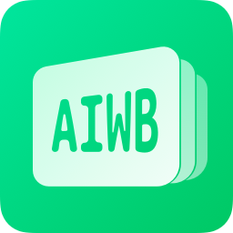

<picture>
    <source media="(prefers-color-scheme: dark)" srcset="./assets/aiwb-resources/awesome-iwb-icon-dark.png">
    
</picture>

<h1>Awesome Iwb</h1>

可能是 **最全的** 电教与希沃一体机软件推荐列表 
收集各类开源优质项目，让班级大屏更好用! 
**🌟 Awesome Iwb 助力每一位电教的成长 🌟**

# 导引 & 目录 

## 📅 课表软件

还在用物理意义上的“黑板磁吸贴”来展示你们每天的课程表吗？还在黑板上手写每天的课程表吗？这样不仅换课麻烦，想必写课表的那位同学也很辛苦吧。如果用上了各位同学开发的好用的课程表软件们，说不定一切会有所改善呢。下面给各位同学推荐一些：

| 排名 | 项目 | 开发者 | |
| - | - | - | - |
|  |  [ClassIsland](#classisland) | <picture><source media="(prefers-color-scheme: dark)" srcset="https://images.weserv.nl/?url=github.com/HelloWRC.png?v=4&h=64&w=64&fit=cover&mask=circle&maxage=7d&bg=222"></picture>&nbsp;<a href="https://github.com/HelloWRC">HelloWRC</a> |  |
|  |  [Class Widgets](#class-widgets) | <picture><source media="(prefers-color-scheme: dark)" srcset="https://images.weserv.nl/?url=github.com/RinLit-233-shiroko.png?v=4&h=64&w=64&fit=cover&mask=circle&maxage=7d&bg=222"></picture>&nbsp;<a href="https://github.com/RinLit-233-shiroko">RinLit</a> |  |
|  |  [ZongziTEK 黑板贴](#zongzitek-黑板贴) | <picture><source media="(prefers-color-scheme: dark)" srcset="https://images.weserv.nl/?url=github.com/STBBRD.png?v=4&h=64&w=64&fit=cover&mask=circle&maxage=7d&bg=222"></picture>&nbsp;<a href="https://github.com/STBBRD">ZongziTEK</a> |  |
|  |  [ElectronClassSchedule](#electronclassschedule) | <picture><source media="(prefers-color-scheme: dark)" srcset="https://images.weserv.nl/?url=github.com/EnderWolf006.png?v=4&h=64&w=64&fit=cover&mask=circle&maxage=7d&bg=222"></picture>&nbsp;<a href="https://github.com/EnderWolf006">EnderWolf006</a>  |  |

# 正文

##  ClassIsland 

 
⭐️ **Stars**: 983 | 🍴 **Forks**: 138 | ⬇️ **下载量**: 78.9k | 🕓 **创建于**: 2023/01/08 
**类型**: 开源免费软件 | **适用平台**: **Windows7** 以上 & **Linux** | **活跃度**: 非常高 
💻 **技术栈**: `WPF` `.NET8` `C#` | 🌐 **语言**: 中文 | 🔥 **内存压力**: **较大**，300+MB

 ClassIsland 是一款适用于班级多媒体屏幕的课表信息显示工具，可以在 Windows 屏幕上显示各种信息。本应用的名字灵感源于 iOS 灵动岛（Dynamic Island）功能。

 **ClassIsland** 是一款专为教室或班级多媒体屏幕设计的课表信息显示工具，它借鉴了 iOS 灵动岛的设计理念，在 Windows 系统上（2025/07/20 修订：目前 **ClassIsland** 正在基于跨平台 UI 框架 [`Avalonia`](https://avaloniaui.net/) 开发跨平台版本，支持 `Windows` 和 `Linux` [`X11`](https://zh.wikipedia.org/zh-tw/X%E8%A6%96%E7%AA%97%E7%B3%BB%E7%B5%B1) 平台，换成 [`Avalonia`](https://avaloniaui.net/) 的最大好处就是用上了 [`Skia`](https://skia.org/) 渲染，摆脱了 [`WPF`](https://zh.wikipedia.org/wiki/Windows_Presentation_Foundation) 古老的 [`DirectX`](https://zh.wikipedia.org/zh-tw/DirectX) 9，提升了渲染性能，动画也变得更好看了）实现了动态美观的课表展示。软件整体使用 [`Material Design 2`](https://m2.material.io/) 设计（使用的是 [`WPF`](https://zh.wikipedia.org/wiki/Windows_Presentation_Foundation) 的 [`MaterialDesignInXamlToolkit`](https://github.com/MaterialDesignInXAML/MaterialDesignInXamlToolkit) UI 库来实现的），支持显示今日课表、上下课提醒（含音效、语音、动画特效等，语音可以使用系统自带 TTS，或者是 [`EdgeTTS`](https://github.com/rany2/edge-tts)，甚至可以用 GPT-Sovits），并可灵活设置课程表界面的隐藏方式以不干扰正常教学授课。同时内置高效易用的课表编辑器，支持从 Excel、[`CSES`](https://github.com/SmartTeachCN/CSES) 等多种来源导入导出（CSES 是通用课表交换格式），并允许临时换课、轮换周表等复杂管理。用户可以通过添加组件（如时间、天气、倒计日）和插件进行个性化定制，还能自定义主题界面。软件还提供天气预报、自动化操作、权限保护、动画过渡、系统色适配（支持提取壁纸主色）、自动更新等辅助功能，适合在班级一体机上高效的显示课表。

 ~~**非常好用，由你好微软草开发的课是地，使我开学必装**~~，支持多周轮换和临时课表，以及超高的自定义程度，CI 已经是目前最强大的桌面课表软件了，还附带了插件系统和自定义主题系统，可以通过自己开发插件来扩充 CI 的功能，如果你想要试试水，给班上的一体机换新貌的话，我非常推荐！

 ClassIsland 目前来看没有课表软件比它更好用，但是整个软件配置比较复杂，不建议在班里电脑上盲开。建议先在家里设置好，研究明白再安到电脑上。如果你电脑水平较弱，那建议你~~别当电教~~移步其它软件。

 
`[1]` **ClassIsland – 在教室大屏幕上显示「课表信息」，支持上下课、放学提醒，语音播报[Windows] - 小众软件**： https://www.appinn.com/classisland/ 
`[2]` **颠覆你的工作方式：不可不试的5款效率神器！ - C$DN**： https://blog.csdn.net/qxf865618770/article/details/141522869 
`[3]` **ClassIsland - 在教室大屏幕上显示课表信息，支持语音播报 - 哔哩哔哩**（开发者官方发布的宣传视频）： https://www.bilibili.com/video/BV1Rm421g7X3/ 
`[4]` **ClassIsland 入门教程 - 哔哩哔哩**（来自开发者发布的入门教程）： https://www.bilibili.com/video/BV1fA4m1A7uZ/  
`[5]` **ClassIsland 课表工具 1.5 版本更新日志：自定义组件、插件系统、字体自定义、以及更多新功能！ - 哔哩哔哩**（来自开发者发布的 1.5 版本更新日志视频）： https://www.bilibili.com/video/BV1EEsNeYEc9/ 
`[6]` **【ClassIsland】你的课表，比想象更聪明 - 哔哩哔哩**（开发者官方发布的宣传视频）： https://www.bilibili.com/video/BV1EEsNeYEc9/ 
`[7]` **【ClassIsland 更新日志】1.7 更新日志：滚动组件、天气增强、课表功能优化、主题集成以及更多新功能！ - 哔哩哔哩**（来自开发者发布的 1.7 版本更新日志视频）： https://www.bilibili.com/video/BV1y2Jxz1Et7/ 
`[8]` **ClassIsland——适用于大屏的课表小工具 - 哔哩哔哩**（开发者官方发布的宣传视频）： https://www.bilibili.com/video/BV1Lt421n7op/ 
`[9]` **全自动？多课表？多功能教学课表软件的再次「进化」| ClassIsland 宣传 PV - 哔哩哔哩**（ClassIsland 重度用户制作的宣传视频）： https://www.bilibili.com/video/BV1AqFYeoEZ6/

 
**该项目是开源项目，完全免费使用，有社区提供技术支持** <table>
<tr>
    <td></td>
    <td><b>GitHub</b></td>
    <td><a href="https://github.com/ClassIsland/ClassIsland/">ClassIsland/ClassIsland</a></td>
</tr>
<tr>
    <td></td>
    <td><b>GitHub(.NET 6)</b></td>
    <td><a href="https://github.com/ClassIsland/ClassIsland-net6/">ClassIsland/ClassIsland-net6</a></td>
</tr>
<tr>
    <td></td>
    <td><b>开发者</b></td>
    <td><picture><source media="(prefers-color-scheme: dark)" srcset="https://images.weserv.nl/?url=github.com/HelloWRC.png?v=4&h=64&w=64&fit=cover&mask=circle&maxage=7d&bg=222"></picture>&nbsp;<a href="https://github.com/HelloWRC">HelloWRC</a></td>
</tr>
</table>

 <table>
<tr>
    <td></td>
    <td><b>GitHub</b></td>
    <td>
</td>
</tr>
<tr>
    <td></td>
    <td><b>QQ</b></td>
    <td>
</td>
</tr>
</table>